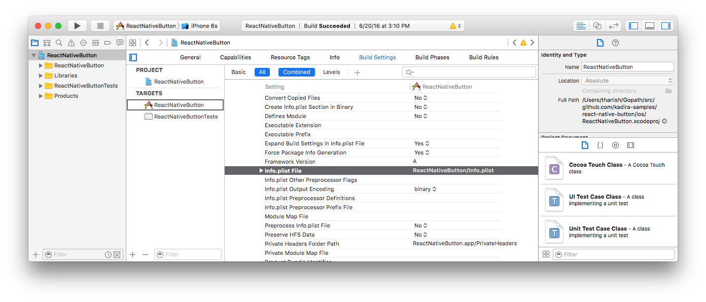
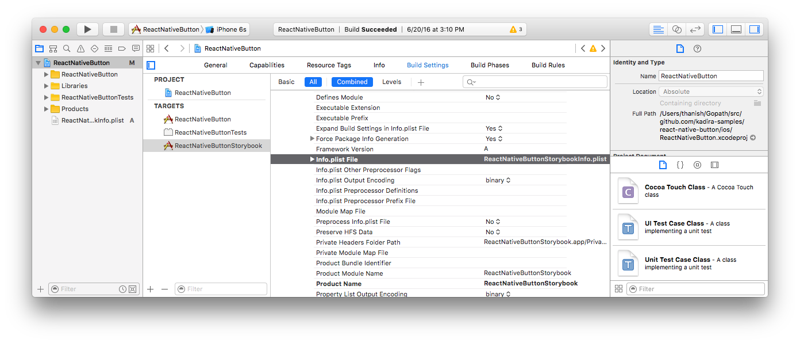
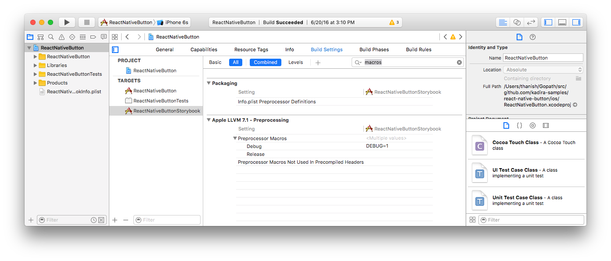
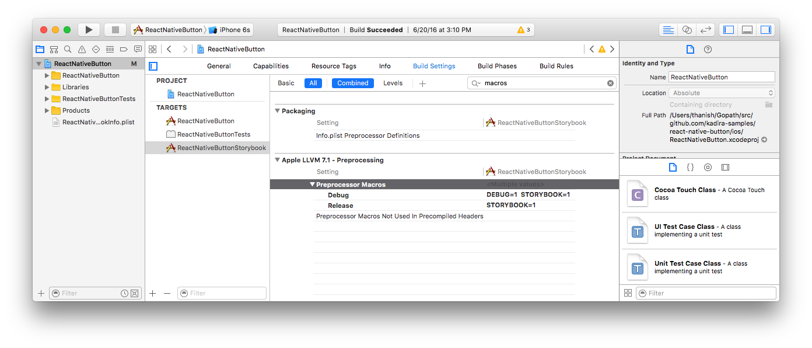
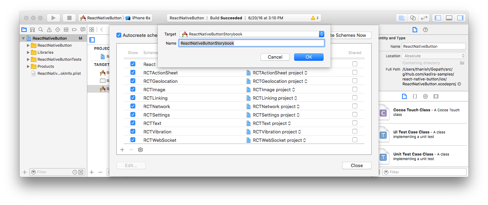
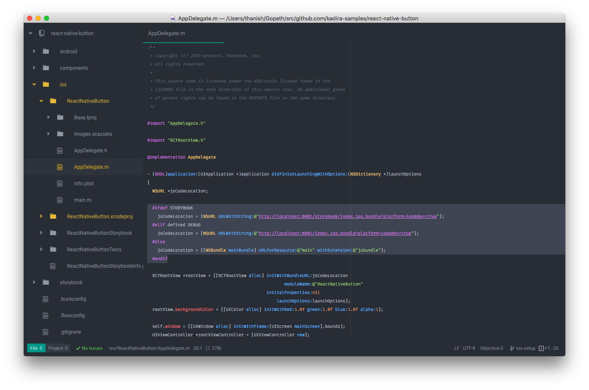

# Setup Storybook for iOS

Replacing the main *index.ios.js* maybe good for cuickly checking it out but for long term use, it is recommended to setup the storybook as a separate app. After completing these steps:

- The storybook can be started without changing your app javascript files
- Both the app and storybook can be installed on your device at the same time

These steps are made for the **ReactNativeButton** project. Replace **ReactNativeButton** with your app name when following these steps.

## Step 1: create a new build target

Start by opening the **ReactNativeButton.xcodeproj** file inside the *ios* directory. *Right-Click* your main build target **ReactNativeButton** and create a duplicate. (Select "Duplicate Only" if Xcode asks to setup a target for iPads.)



It will create a build target named **ReactNativeButton copy** and a new **ReactNativeButton copy-Info.plist** file. Rename the plist file to **ReactNativeButtonStorybookInfo.plist** and the build target to **ReactNativeButtonStorybook**. For the new build target, set "Info.plist File" property on "Build Settings" to **ReactNativeButtonStorybookInfo.plist**.



## Step 2: add STORYBOOK macro

Next, add a new preprocessor macro named **STORYBOOK** which will be used later to load the correct javascript bundle. (To find the property faster, search for "macros" from "Build Settings".)



Add **STORYBOOK=1** for both "Debug" and "Release". (It's okay if DEBUG=1 appears twice.)



## Step 3: create a new scheme

From the menubar, select "Product" > "Scheme" > "Manage Schemes". If a scheme named **ReactNativeButton copy** exists, delete it. Add a new scheme named **ReactNativeButtonStorybook**. Make the scheme "Shared".



## Step 4: update AppDelegate.m file

Open *ios/ReactNativeButton/AppDelegate.m* file and replace code from

```objective-c
  /**
   * Loading JavaScript code - uncomment the one you want.
```

to

```objective-c
//   jsCodeLocation = [[NSBundle mainBundle] URLForResource:@"main" withExtension:@"jsbundle"];
```

with

```objective-c
#ifdef STORYBOOK
  jsCodeLocation = [NSURL URLWithString:@"http://localhost:8081/storybook/index.ios.bundle?platform=ios&dev=true"];
#elif defined DEBUG
  jsCodeLocation = [NSURL URLWithString:@"http://localhost:8081/index.ios.bundle?platform=ios&dev=true"];
#else
  jsCodeLocation = [[NSBundle mainBundle] URLForResource:@"main" withExtension:@"jsbundle"];
#endif
```



## Step 5: add npm script to start

Add a new npm script to quickly launch the storybook. Set the correct app identifier which is available in the **ReactNativeButtonStorybookInfo.plist** file.

```json
{
  "storybook-ios": "storybook run-ios -a ReactNativeButtonStorybook -i org.reactjs.native.example.ReactNativeButtonStorybook"
}
```

To run the storybook, run these 3 commands on separate terminal windows

```
npm run start
npm run storybook
npm run storybook-ios
```

And open **http://localhost:9001** on a web browser.